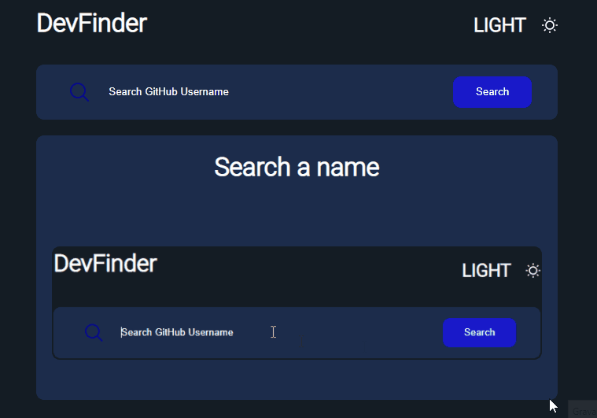

# Github users search 

<h1 align="center">
    
</h1>

 

<h2>About:</h2>
 

Uma aplicação que permite pesquisar e obter informações dos  usuários da plataforma GitHub.   A aplicação faz o uso da API do GitHub, que permite realizar pesquisas dos usuários.

O aplicativo oferece dois temas: tema escuro e tema claro. O tema inicial é definido nas configurações do usuário, mas o usuário pode alterar o tema sempre que quiser

 

<h2>Technologies:</h2>
<li>CSS</li>
<li>HTML</li>
<li>JavaScript</li>
<li>React.js</li>

<h2 align="center">⚠️⚠️ Not finished ⚠️⚠️</h2>